# 🕹️ WT32-SC01 Multi-Game Touch Arcade Hub

[](https://micropython.org/)
[](https://www.seeedstudio.com/WT32-SC01-Development-Board-p-4752.html)
[]()
[]()
[](LICENSE)

A standalone, touch-driven **Retro Arcade & Board Game Console** built in **MicroPython** specifically for the **WT32-SC01** development board (ESP32 Dual-Core + 3.5" 320×480 capacitive touch LCD).

Includes **12 complete games, puzzles, strategy engines, and AI solvers** optimized for low-memory microcontrollers with zero-heap-allocation drawing pipelines, smooth 60 FPS rendering, persistent flash storage, and intuitive touchscreen gestures.

---

## 📸 Screenshots & UI Showcase

<div align="center">
  <table>
    <tr>
      <td align="center"><b>2-Page Arcade Hub Menu</b></td>
      <td align="center"><b>Standard Chess (Minimax AI)</b></td>
    </tr>
    <tr>
      <td>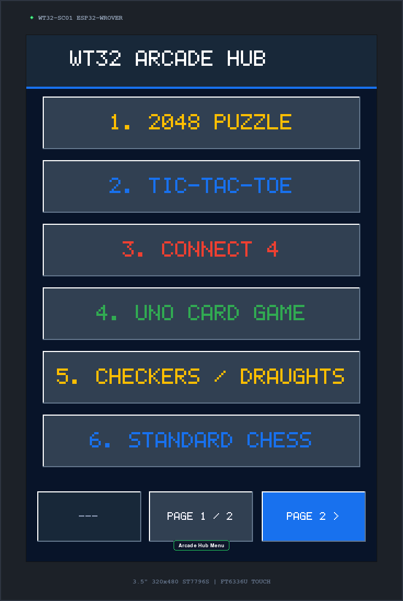</td>
      <td>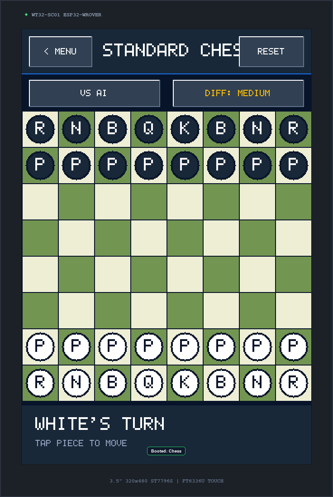</td>
    </tr>
    <tr>
      <td align="center"><b>UNO Card Game (4-Player AI)</b></td>
      <td align="center"><b>2048 Puzzle (Touch Swipe)</b></td>
    </tr>
    <tr>
      <td>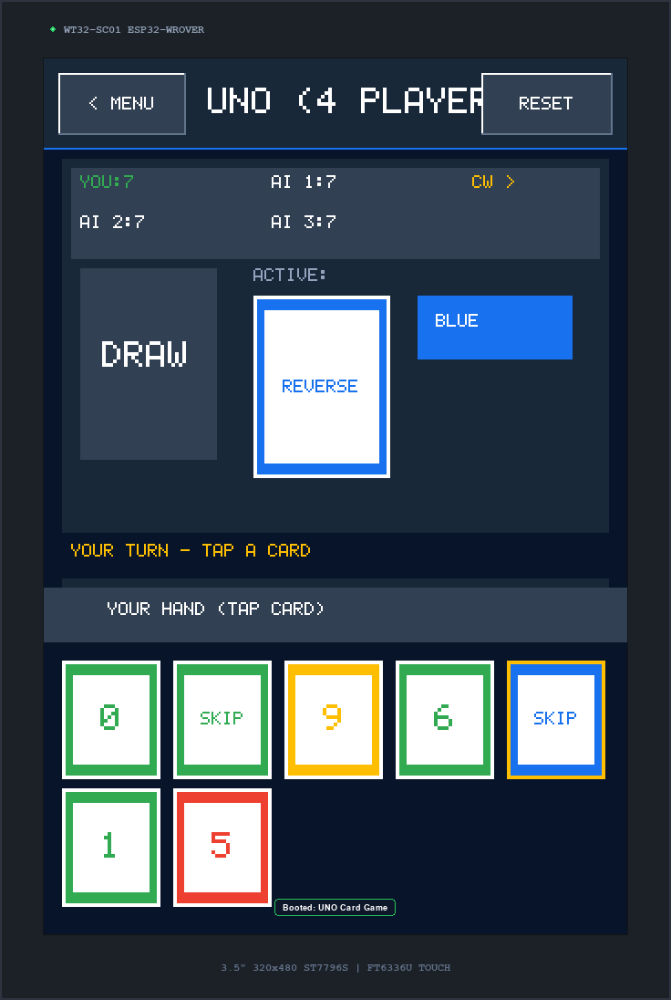</td>
      <td>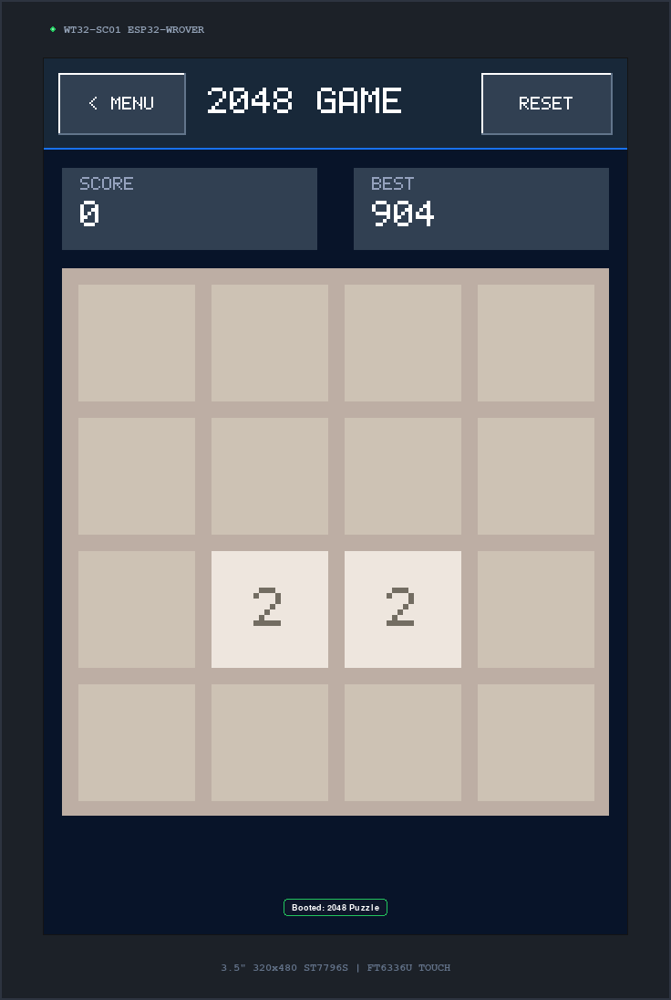</td>
    </tr>
  </table>
</div>

---

## 🔌 Hardware Specifications & Pinout

The software is configured out-of-the-box for the **Wireless-Tag WT32-SC01 (v3.2)**:

| Component | Specification | Controller / Interface | ESP32 GPIO Pin |
|---|---|---|---|
| **MCU** | ESP32-WROVER-B Dual-Core | 240 MHz, 4MB Flash, 8MB PSRAM | Built-in |
| **Display Panel** | 3.5" TFT LCD (320 × 480 px, RGB565) | ST7796S (SPI @ 20 MHz) | **SCK**: `GPIO 14`<br>**MOSI**: `GPIO 13`<br>**MISO**: `GPIO 12`<br>**CS**: `GPIO 15`<br>**DC**: `GPIO 21`<br>**RST**: `GPIO 22`<br>**Backlight**: `GPIO 23` |
| **Touch Screen** | 2-Point Capacitive Multi-Touch | FT6336U (I2C @ 400 kHz, Addr `0x38`) | **SDA**: `GPIO 18`<br>**SCL**: `GPIO 19`<br>**INT**: `GPIO 39` |
| **Power** | 5V USB Type-C | Onboard LDO | USB-C |

---

## 🚀 Installation & Flashing Guide

### 1. Flash MicroPython to WT32-SC01
Download the standard ESP32 MicroPython firmware with SPIRAM support from [micropython.org/download/esp32](https://micropython.org/download/esp32/).

Erase the flash and write the firmware via `esptool`:
```bash
# Erase existing firmware
esptool.py --chip esp32 --port /dev/ttyUSB0 erase_flash

# Flash MicroPython firmware
esptool.py --chip esp32 --port /dev/ttyUSB0 --baud 460800 write_flash -z 0x1000 esp32-spiram-firmware.bin
```
*(Replace `/dev/ttyUSB0` with your serial port, e.g., `COM3` on Windows or `/dev/tty.usbserial-*` on macOS).*

---

### 2. Upload Game Code to the Board
Using `mpremote` (recommended) or any file transfer tool (`ampy`, `rshell`, or Thonny IDE):

```bash
# Install mpremote
pip install mpremote

# Upload all Python scripts to the root of the WT32-SC01
mpremote fs cp *.py :
```

Alternatively, you can open the project folder in **Thonny IDE**, select the **MicroPython (ESP32)** interpreter, and upload all files to the device.

---

### 3. Automatic Boot
When power is applied to the USB-C port, the board executes `main.py` automatically, initializes the ST7796S display and FT6336U touch controller, and opens the **WT32 Arcade Hub**.

---

## 🕹️ Navigating the Arcade Hub

- **Touch Buttons**: Tap any game button to boot immediately.
- **Page Flipping**:
  - Tap **`< PAGE 1`** or **`PAGE 2 >`** on the bottom navigation bar, **OR**
  - **Swipe Left / Right** horizontally anywhere on the screen.
- **Header Navigation Bar**:
  - **`< MENU`** (Top-Left): Returns to the Arcade Hub and automatically frees memory.
  - **`RESET`** (Top-Right): Instantly restarts the currently active game.

---

## 🎮 Complete Games Guide & How to Play

### Page 1: Classic Games

#### 1. 2048 Puzzle (`game_2048.py`)
        
- **Goal**: Slide tiles across a 4×4 grid to merge matching numbers until you create the **2048** tile.
- **How to Play**:
  - **Swipe** in any of the 4 directions (**Up**, **Down**, **Left**, **Right**) on the touchscreen.
  - When two tiles with the same number collide during a swipe, they combine into one ($2+2=4$, $4+4=8$, etc.).
  - High score is automatically saved across games.
    
    <table>
          <tr>
            <td>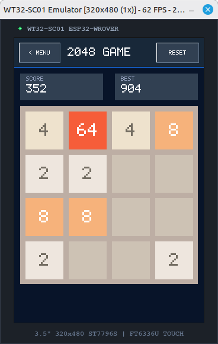</td>
          </tr>
    </table>
    
#### 2. Tic-Tac-Toe (`game_ttt.py`)
   
- **Goal**: Place 3 of your marks in a horizontal, vertical, or diagonal row.
- **How to Play**:
  - Tap any open square on the 3×3 grid to place your **X** (Blue) or **O** (Red).
  - Play against a built-in **Minimax AI** opponent or in 2-Player pass-and-play mode.
 
     <table>
      <tr>
        <td>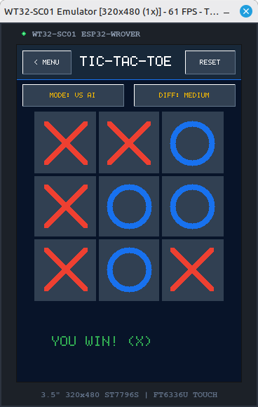</td>
      </tr>
    </table>

#### 3. Connect 4 (`game_c4.py`)
   
- **Goal**: Connect four colored discs in a row (horizontal, vertical, or diagonal) on a 7×6 grid.
- **How to Play**:
  - Tap any column header to drop your disc into that column.
  - Features gravity physics and animated disc drops against an AI opponent.
 
     <table>
      <tr>
        <td>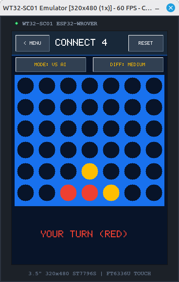</td>
      </tr>
    </table>

#### 4. UNO Card Game (`game_uno.py`)
    
- **Goal**: Be the first player to discard all cards from your hand against 3 AI opponents.
- **How to Play**:
  - **Playing Cards**: Tap a card in your hand that matches the top discard pile by **Color**, **Number**, or **Action**.
  - **Drawing**: Tap the **Draw Pile** on the left if you don't have a playable card.
  - **Action Cards**:
    - **Skip (🚫)**: Skips the next player's turn.
    - **Reverse (🔄)**: Reverses turn direction.
    - **Draw Two (+2)**: Next player draws 2 cards and forfeits their turn.
    - **Wild (🌈)**: Play anytime; opens a touch popup to choose the active color (Red, Blue, Green, Yellow).
    - **Wild Draw Four (+4)**: Changes color and forces the next player to draw 4 cards.
   
      <table>
      <tr>
        <td>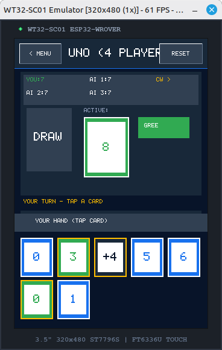</td>
      </tr>
    </table>

#### 5. Checkers / Draughts (`game_checkers.py`)
    
- **Goal**: Capture all opponent pieces or block them from making legal moves.
- **How to Play**:
  - Tap your piece (highlighted in gold) to see valid target squares, then tap a destination.
  - Jump over opponent pieces into an empty square to capture. Mandatory multi-jumps are chained automatically.
  - Reaching the opponent's back row crowns your piece as a **King**, enabling diagonal movement and jumping backward.
 
    <table>
      <tr>
        <td>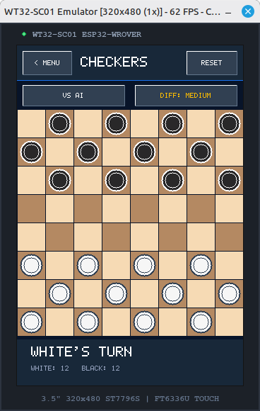</td>
      </tr>
    </table>

#### 6. Standard Chess (`game_chess.py`)
    
- **Goal**: Checkmate the opponent's King.
- **How to Play**:
  - Tap a piece to highlight all legal move destinations, then tap the target square.
  - Supports all standard FIDE rules: Castling (kingside/queenside), En Passant, Pawn double-step, and Pawn Promotion (touch selector modal for Queen, Rook, Bishop, Knight).
  - Built-in Minimax evaluation AI with material and positional tables.
 
    <table>
      <tr>
        <td>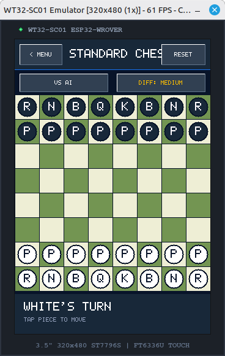</td>
      </tr>
    </table>

---

### Page 2: Strategy Games, Puzzles & Utilities

#### 7. Alquerque - Orthogonal Mode (`game_alq.py`)
    
- **Goal**: Ancient 5×5 Middle Eastern board game. Capture all opponent pieces.
- **How to Play**:
  - Tap a piece, then tap an adjacent connected intersection along grid lines.
  - Capture opponent pieces by jumping over them into an empty point behind them.
  - Restricts movement to horizontal and vertical lines.
 
    <table>
      <tr>
        <td>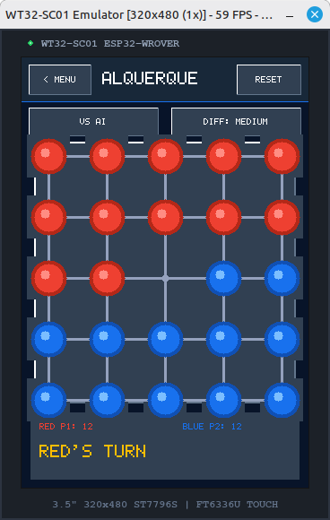</td>
      </tr>
    </table>

#### 8. Alquerque - Full Diagonal Mode (`game_alq_full.py`)
    
- **Goal**: Full-board variant of Alquerque on a 5×5 lattice with 12 pieces per player.
- **How to Play**:
  - Supports diagonal movement and captures across all marked diagonal lines on the board.
 
    <table>
      <tr>
        <td>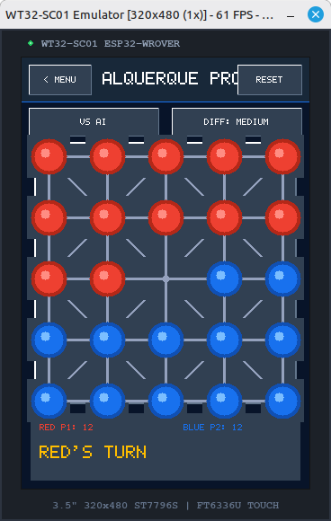</td>
      </tr>
    </table>

#### 9. Dots & Boxes (`game_dots.py`)
    
- **Goal**: Complete the 4th side of 1×1 square boxes to claim territory and score points.
- **How to Play**:
  - Tap the gap between two adjacent dots to draw a line.
  - Completing a square box fills it with your color and awards you an **extra turn**.
  - The player with the most boxes when the grid is full wins.
 
    <table>
      <tr>
        <td>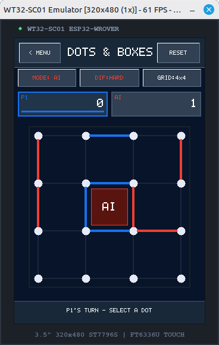</td>
      </tr>
    </table>

#### 10. Dots & Triangles (`game_tri_dots.py`)
   
- **Goal**: Connect dots on a triangular lattice grid to complete triangles.
- **How to Play**:
  - Tap between adjacent dots on the triangular grid to connect edges.
  - Completing a 3-sided triangle claims the area and awards an extra move.
 
     <table>
      <tr>
        <td>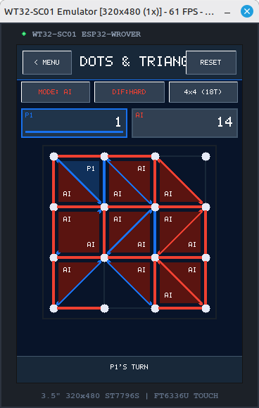</td>
      </tr>
    </table>

#### 11. Alquerque Solver & Analyzer (`game_alq_solver.py`)
   
- **Goal**: Real-time AI game-tree solver and analysis tool.
- **How to Play**:
  - Setup custom board positions and view real-time minimax evaluations, depth search metrics, and optimal suggested moves.
 
     <table>
      <tr>
        <td>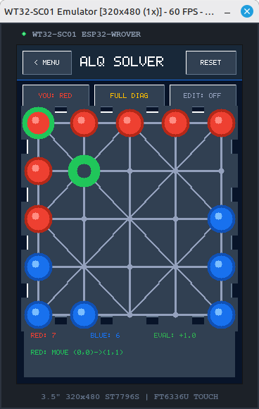</td>
      </tr>
    </table>

#### 12. Scoreboard & Statistics Dashboard (`main.py`)
   
- **Overview**: Displays cumulative win/loss/draw records and high scores across all games loaded from `stats.json`.
- Tap **CLEAR ALL STATS** at the bottom to reset all records.

   <table>
      <tr>
        <td>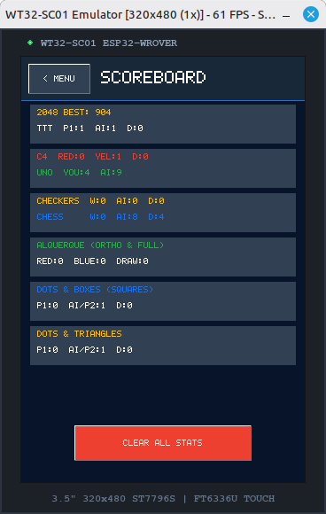</td>
      </tr>
    </table>

---

## ⚡ MicroPython Optimization & Architecture

The WT32-SC01 Arcade Hub is built specifically to operate smoothly within the memory and performance boundaries of the ESP32:

1. **Zero-Heap Hardware Drivers**:
   - [`ft6336u.py`](ft6336u.py): Reads I2C touch registers directly into a pre-allocated reusable `bytearray(5)` buffer to prevent heap fragmentation.
   - [`st7796s.py`](st7796s.py): Employs a pre-allocated command buffer and chunked scanline transfer over 20 MHz SPI.
2. **Dynamic Memory Lifecycle**:
   - Games are imported on-demand. When returning to the Main Menu via the `< MENU` button, active game modules are cleanly purged from `sys.modules` followed by an explicit `gc.collect()`.
3. **Session Persistence**:
   - `game_state.json` serializes current game boards, hands, and moves to the onboard flash, allowing sessions to resume after power loss.
   - `stats.json` maintains persistent lifetime statistics across all 12 games.

---

## 📁 File Structure

```
.
├── arcade_common.py             # Design system, RGB565 colors, Scoreboard, SwipeDetector
├── ft6336u.py                   # MicroPython FT6336U capacitive touch driver
├── st7796s.py                   # MicroPython ST7796S 320x480 TFT LCD driver
├── main.py                      # WT32-SC01 Arcade Hub & 2-page menu launcher
├── game_2048.py                 # 2048 Puzzle Game
├── game_ttt.py                  # Tic-Tac-Toe Game
├── game_c4.py                   # Connect 4 Game
├── game_uno.py                  # UNO Card Game
├── game_checkers.py             # Checkers / Draughts Game
├── game_chess.py                # Standard Chess Game
├── game_alq.py                  # Alquerque (Orthogonal) Game
├── game_alq_full.py             # Alquerque (Full Diagonal) Game
├── game_dots.py                 # Dots & Boxes Game
├── game_tri_dots.py             # Dots & Triangles Game
├── game_alq_solver.py           # Alquerque Solver & Analyzer Tool
└── README.md                    # Hardware documentation
```

---

## 📄 License

This project is open-source and licensed under the **[MIT License](LICENSE)**.
